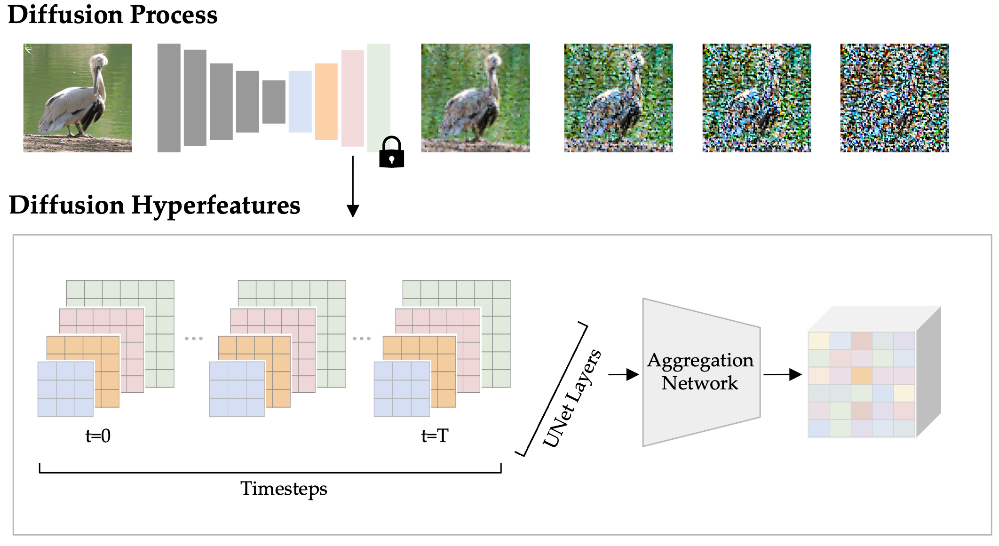

# Diffusion Hyperfeatures: Searching Through Time and Space for Semantic Correspondence
This repository contains the code accompanying the paper [Diffusion Hyperfeatures: Searching Through Time and Space for Semantic Correspondence](https://diffusion-hyperfeatures.github.io). The code implements Diffusion Hyperfeatures, a framework for consolidating multi-scale and multi-timestep feature maps from a diffusion model into per-pixel feature descriptors.



## Releases
- 🚀 2024/02/17 - Added [generic training code](train_generic.py) for how one might train Diffusion Hyperfeatures for things beyond semantic correspondence.
- 🚀 2023/09/28 - Added [training code](train_hyperfeatures.py) for Diffusion Hyperfeatures.
- 🚀 2023/07/07 - Added [extraction code](extract_hyperfeatures.py) and demos for [real](real_demo.ipynb) / [synthetic](synthetic_demo.ipynb) images for Diffusion Hyperfeatures.

## Setup
This code was tested with Python 3.8. To install the necessary packages, please run:
```
conda env create -f environment.yml
conda activate dhf
```

## Pretrained Networks
You can download the following pretrained aggregation networks by running `download_weights.sh`.
- [Ours - SDv1-5](http://diffusion_hyperfeatures.berkeleyvision.org/weights/aggregation_network.pt)
- [Ours - SDv1-5 (One-Step)](http://diffusion_hyperfeatures.berkeleyvision.org/weights/aggregation_network_one-step.pt)
- [Ours - SDv2-1](http://diffusion_hyperfeatures.berkeleyvision.org/weights/aggregation_network_sdv2-1.pt)

## Extraction
To extract and save Diffusion Hyperfeatures for your own set of real images, or a set of synthetic images with your own custom prompts, run `extract_hyperfeatures.py`.

To run on real images, you can provide a folder of images with or without corresponding annotations.
```
python3 extract_hyperfeatures.py --save_root hyperfeatures --config_path configs/real.yaml --image_root assets/spair/images --images_or_prompts_path annotations/spair_71k_test-6.json 

python3 extract_hyperfeatures.py --save_root hyperfeatures --config_path configs/real.yaml --image_root assets/spair/images --images_or_prompts_path ""
```

To run on synthetic images, you can provide a json file containing a list of prompts.
```
python3 extract_hyperfeatures.py --save_root hyperfeatures --config_path configs/synthetic.yaml  --image_root "" --images_or_prompts_path annotations/synthetic-3.json
```

## Training
To train an aggregation network on your own custom dataset containing images and their labeled correspondences, use our training script provided below. We recommend first training a one-step model, which converges much faster but to a worse final performance than the multi-step model, to ensure that everything is working correctly. You can configure this with the `save_timestep` and `num_timesteps` fields in the config file. You can also configure the base model (SDv1-5 vs SDv2-1) with the `model_id` field. You can replace our pretrained weights when running the jupyter notebook with your own by replacing the `weights_path` field.
```
python3 train_hyperfeatures.py --config_path configs/train.yaml
```
Make sure to configure wandb for wandb logging.
```
wandb login
```
Make sure you also download the SPair-71k dataset if you want to use our default config.
```
mkdir datasets
wget -P datasets http://cvlab.postech.ac.kr/research/SPair-71k/data/SPair-71k.tar.gz
tar -xvf datasets/SPair-71k.tar.gz -C datasets
```

## Semantic Keypoint Matching
We also provide demos for the semantic keypoint matching task using Diffusion Hyperfeatures.

For real images, [**real_demo**](real_demo.ipynb) waks through visualizing correspondences using either nearest neighbors or mutual nearest neighbors.

For synthetic images, [**synthetic_demo**](synthetic_demo.ipynb) provides an interactive demo for visualizing correspondences given different prompts and different sets of user annotated source points.

## Citing
```
@inproceedings{luo2023dhf,
  title={Diffusion Hyperfeatures: Searching Through Time and Space for Semantic Correspondence},
  author={Luo, Grace and Dunlap, Lisa and Park, Dong Huk and Holynski, Aleksander and Darrell, Trevor},
  booktitle={Advances in Neural Information Processing Systems},
  year={2023}
}
```
## Acknowledgements
Our codebase builds on top of a few prior works, including [Deep ViT Features as Dense Visual Descriptors](https://github.com/ShirAmir/dino-vit-features), [Zero-Shot Category-Level Object Pose Estimation](https://github.com/applied-ai-lab/zero-shot-pose), [Shape-Guided Diffusion](https://github.com/shape-guided-diffusion/shape-guided-diffusion), and [ODISE](https://github.com/NVlabs/ODISE).